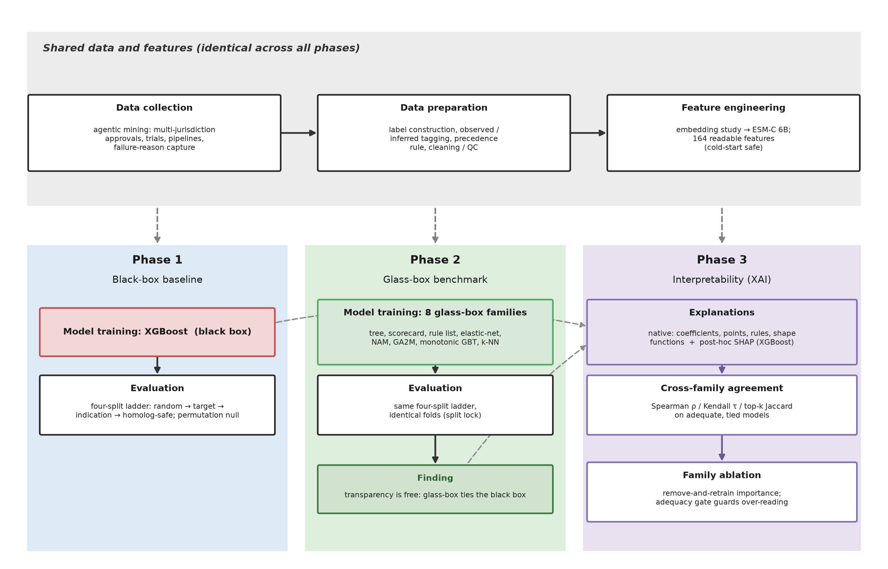
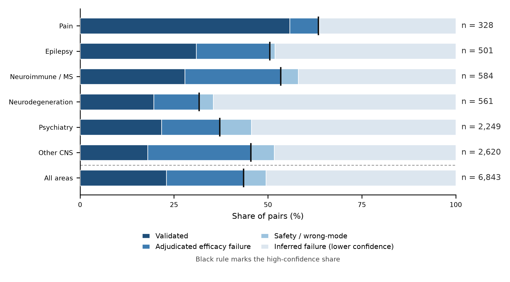
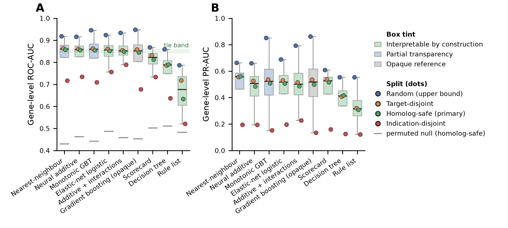
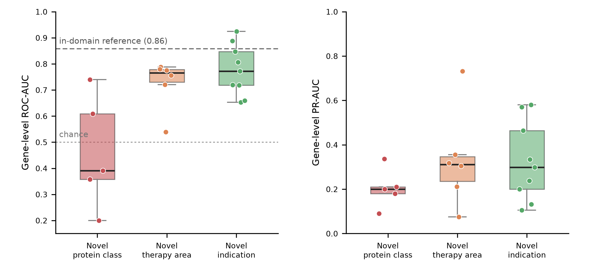
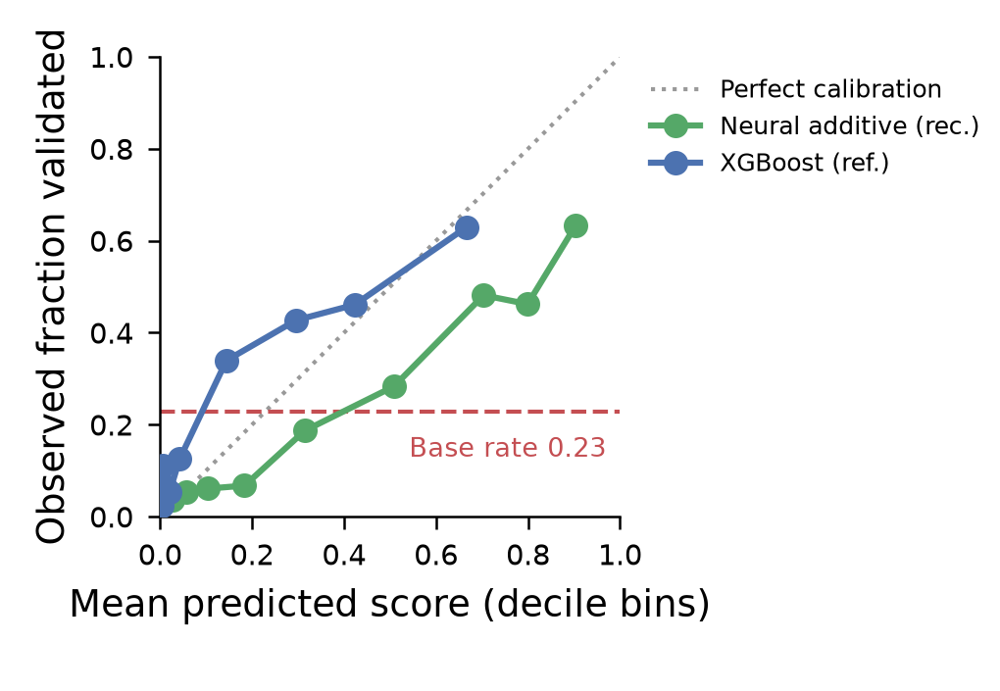
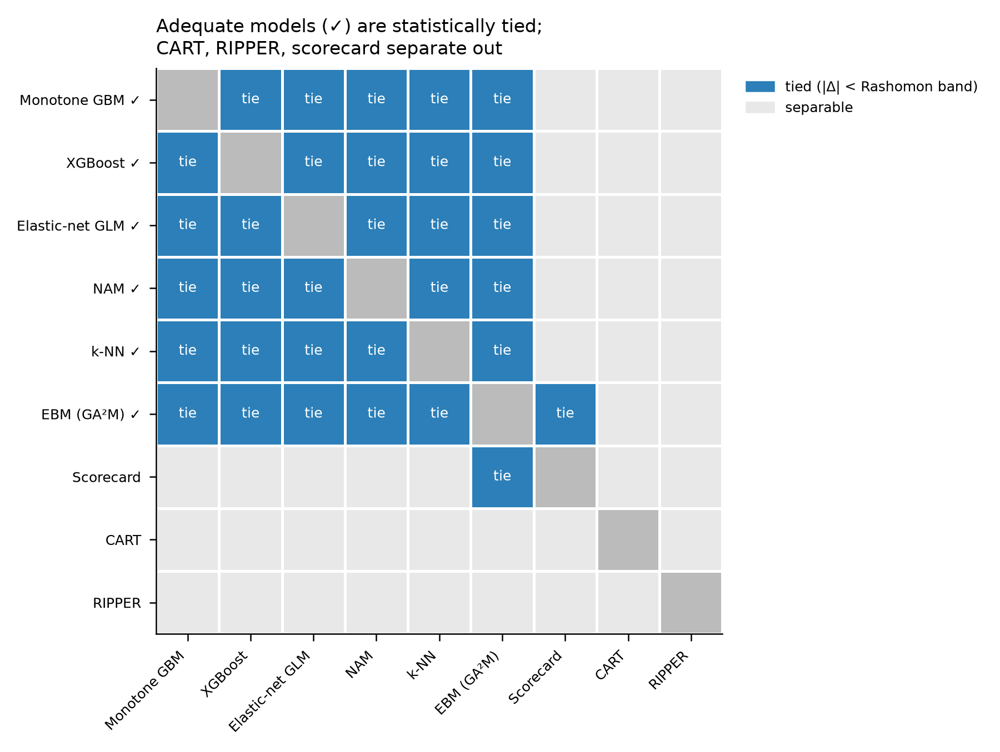
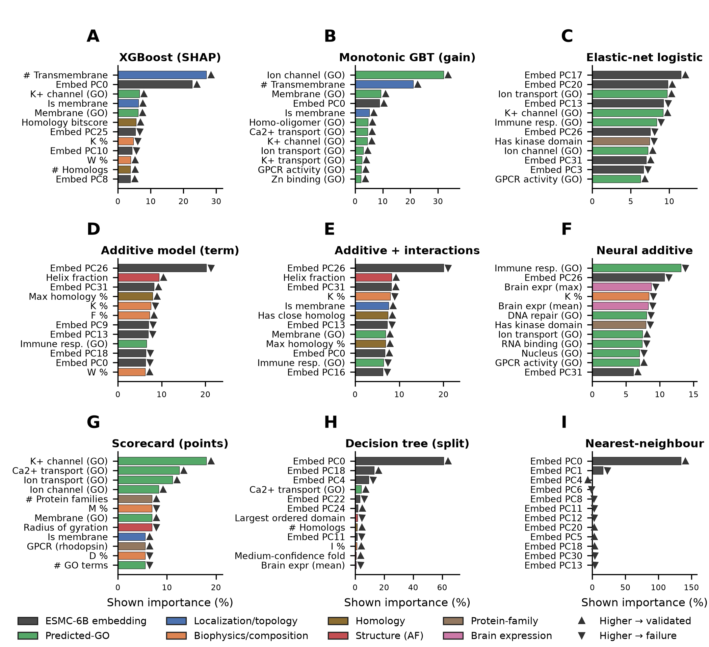
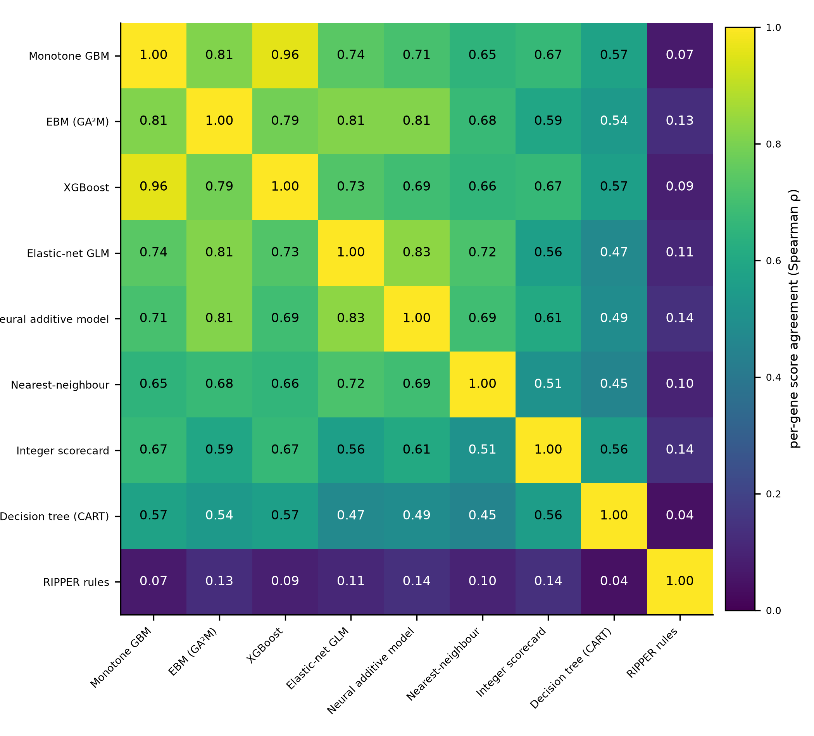
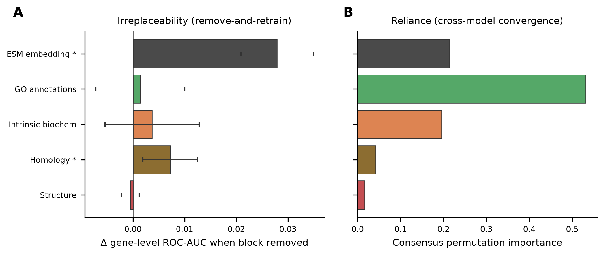

# Predicting Clinical Validation of Central Nervous System Drug Targets with Interpretable Glass-Box Models

Aimie E. Garces

*Independent Researcher*

## Abstract

The highest-stakes decision in drug development is made years before a trial reads out: which target to pursue for which indication. That choice fails more often in the central nervous system (CNS) than in any other area, and it fails largely because the target hypothesis was wrong rather than because the molecule was. A question therefore arises that can be posed before any molecule exists: can the clinical validation of a CNS target-indication pair be predicted from the intrinsic biology of the target alone, and can it be predicted with a model whose reasoning can be read rather than merely trusted? To address this, a pan-CNS dataset of 6,843 target-indication pairs, spanning 1,786 genes and 258 indications, was assembled by an agentic data-collection workflow that recovers the informative failures approval registries omit. Each protein was described only by its sequence and quantities derived from it, all available before any clinical outcome is known, and nine model families, from transparent by construction to fully opaque, were compared under a homolog-safe split that holds whole families of similar proteins out together. Interpretability proved free. The interpretable families were statistically equivalent to the opaque reference, six of the nine differing by at most 0.0125 in gene-level ROC-AUC, well inside the seed-to-seed noise, and three of them interpretable by construction. A remove-and-retrain analysis showed all six drawing on the same readable account of the biology, membrane, ion-channel, and immune-function features, of which only the protein-sequence embedding and sequence homology could not be removed without loss. On the homolog-safe split the reference model reached a target-level ROC-AUC of 0.85, though the figure depends on the question asked: 0.85 for ranking any target against any other, 0.80 at the level of individual target-indication pairs, and 0.68 for ranking candidate targets within a single disease, the question a committee actually faces. Performance held for unseen targets and indications but broke down for unseen protein classes, which marks the limit of the applicability domain. The result is a target-ranking tool for CNS indications whose transparency costs nothing in accuracy, and whose honest operating envelope, rather than an optimistic in-sample number, is what a target-selection committee should act on.

## Introduction

Bringing a single new medicine to market now costs on the order of one to a few billion US dollars, a figure dominated not by the eventual success but by the many programmes that fail along the way.1,2 Only about one drug in ten that enters clinical development is ultimately approved, and the rate varies several-fold across therapeutic areas, with central-nervous-system (CNS) indications sitting near the bottom of that distribution.3–5 The dominant reason for failure is not chemistry, manufacturing, or safety but lack of efficacy: the drug engages its intended target as designed and the disease does not respond, a verdict on the target hypothesis rather than on the molecule.6,7 The long-run decline in research productivity captured by "Eroom's law" has been attributed substantially to this problem of backing biological hypotheses that do not hold up,8 and in the CNS the pattern is at its most severe, with disease-modifying neurodegeneration programmes approaching complete clinical failure.9,10

Nowhere is this clearer than in the major neurodegenerative and neuropsychiatric diseases, where the most expensive campaigns in the industry have played out. Alzheimer's disease is the defining case: two decades of anti-amyloid programmes failed to alter the course of the disease, an outcome now read as the right target engaged too late and with insufficient selectivity, before lecanemab and donanemab, which target aggregated amyloid in early biomarker-defined disease, finally slowed cognitive decline.11–13 The same signature recurs across the CNS. In Parkinson's disease, isradipine showed no effect on progression despite a strong epidemiologic and preclinical rationale, its failure attributed partly to inadequate target engagement at tolerated doses;14 in amyotrophic lateral sclerosis, dexpramipexole failed in a phase 3 trial after an encouraging phase 2;15 and in Huntington's disease, where the causal genetic target is unambiguous, a huntingtin-lowering programme was nonetheless halted, its failure attributed to dose, exposure, and timing rather than to an invalid target.16 Multiple sclerosis stands as the instructive counterpoint: as a neuroimmune disease it is where functional and genetic evidence for targets is densest, and where target choice has most often translated into approved therapies.17 Across these areas the attributed cause of failure is rarely that the biology was unknowable; it is more often a target chosen on weak evidence, engaged at the wrong stage, or never adequately reached.

Since the decisive failure is a failure of the target hypothesis, the highest-leverage decision in the whole enterprise is made years before a trial reads out: the choice of which target to pursue for which indication. That choice rests on the evidence linking a gene to a disease, and the strength of that evidence is known to matter for the eventual outcome, with validation through human genetics and disciplined target-selection frameworks both linked to better clinical success.18,19 Human genetic support in particular has been associated with roughly a two-fold increase in the probability of approval,20,21 an effect whose magnitude depends on evidence type, allelic direction, and how closely the genetic indication matches the tested one,22 and by 2021 about two-thirds of newly approved drugs acted on genetically supported targets.23 Much of the older target-validation literature, by contrast, rests on associative claims that reproduced poorly when tested directly.24,25 Rather than model these external evidence channels, which are themselves shaped by how heavily a target has been studied, this study asks how far target viability can be predicted from the intrinsic biology of the protein alone. A complication specific to the CNS is that a target still fails if the drug never reaches it: the blood-brain barrier excludes most compounds from the brain,26 the pharmacologically correct measure of exposure is the unbound brain-to-plasma partition rather than the total brain level,27 and physicochemical optimisation can be used to design deliberately for penetrance.28 Brain penetrance is therefore a confounder of the approval label rather than a source of target-quality signal, and any honest analysis must avoid rewarding it.

Learning target or target-indication viability from data is not a new idea, and recent models report strong numbers. Supervised models on gene-disease association evidence were an early template,29 the Open Targets Platform systematised genetic and association evidence for prioritisation,30 and models built on association scores augmented with expression, ontology, and protein-interaction features reach high apparent accuracy.31 Trial-level models forecast approval from the accruing record of a programme.32,33 Three features of this literature, however, limit what its headline numbers mean for a genuinely novel target. First, the strongest predictors are often the least available at the moment of choice: trial outcomes, accrual, and sponsor identity are survivorship signals that exist only because a programme already ran, and association scores rise as a target is studied, so a model that leans on them measures accumulated attention as much as biological merit. Second, evaluation is usually optimistic, with performance reported on random or lightly grouped splits in which the test target, a close homolog, or the same disease also appears in training, so the reported accuracy describes an easier task than ranking a target no one has tried; a model evaluated under a genuine temporal hold-out makes the gap explicit, its retrospective association score alone discriminating future clinical entry at close to chance.34 Third, brain penetrance, the CNS-specific confound, is rarely held constant, so a wrong target and a right target that never crossed the blood-brain barrier are scored alike.

A model that withholds or commits hundreds of millions of dollars is actionable only if the reasoning behind its recommendation can be inspected, since a development committee cannot defensibly kill or advance a programme on a number whose basis it cannot examine. Training the most accurate available black-box model and explaining its predictions after the fact is precisely the approach a substantial methodological literature now argues against for high-stakes use.35 A post-hoc explanation is a second model that approximates the first and can be unfaithful to it where fidelity matters most: saliency-style attributions can be insensitive to the model they purport to explain,36 and a recent impossibility result shows that the family of complete and linear attribution methods, which contains the most widely used tools, cannot in general answer basic questions about a model's behaviour better than chance.37 The usual objection to insisting on a transparent model, that it costs accuracy, has weakened for structured tabular problems, where additive glass-box models sit on or near the accuracy frontier and their transparency has repeatedly exposed data artefacts a black box would have silently encoded.38,39 Interpretability is therefore treated as a design constraint rather than a post-hoc addendum, and whether it costs anything here is tested directly.

This study assembles a pan-CNS dataset of target-indication pairs spanning neurodegeneration, neuroimmune disease, psychiatry, epilepsy, and pain, and asks whether the clinical validation of a target-indication choice can be predicted from the intrinsic biology of the target alone, under evaluation strict enough to mean what it says. Four design choices distinguish the analysis. First, the evidence for each pair, both the validated outcomes and the far larger set of failures and abandonments, was gathered by an agentic data-collection workflow rather than read from a single curated feed, yielding a dataset richer in the informative negatives that approval registries omit and carrying a full per-pair audit trail. Second, every protein is described using only information available before any clinical outcome is known, its sequence and quantities derived from it, so that a prediction remains valid for a genuinely novel target that has never entered a trial. Third, models are evaluated under a homolog-safe split, in which whole families of similar proteins are held out together, so the reported accuracy is the honest number to expect for a target with no close relative in the training data. Fourth, interpretability is treated as a design constraint rather than an afterthought, comparing model families that span the full range from transparent by construction to opaque so that the cost of interpretability, if any, can be measured rather than assumed.

The question, in one sentence, is this: across all CNS indications, can the clinical validation of a target-indication choice be predicted from outcome-blind, study-independent properties of the target protein, under a homolog-safe evaluation that reflects a genuinely novel target, and with a model whose reasoning can be read rather than merely trusted?

---

## Methods

## Data collection

Each unit of analysis was a target–indication pair: a human protein under investigation for a specific central-nervous-system (CNS) disease. The study was restricted to CNS indications (nervous-system and mental disorders).

Determining whether a target–indication pair has been clinically validated cannot be done by reading a single database, because no registry records target-level clinical outcomes directly: an approval is recorded against a drug, a trial against a condition, and a discontinuation often against nothing at all. The evidence is scattered across regulatory records, trial registries, curated knowledge bases, company disclosures, and free text, and no single query retrieves it.

The underlying evidence was therefore gathered with an agentic data-collection workflow built on Claude Science, in which a language-model agent, working to a fixed protocol, assembled the evidence for each pair rather than relying on a single curated feed. The workflow is orchestrated. A coordinating agent dispatches many independent sub-agents that work in parallel, each responsible for a target or a batch of pairs. Each sub-agent is able to loop: it issues a query, reads the result, and decides whether to refine the query, follow a cross-reference, or move to the next source, until the evidence for its pairs is complete. This looped, branching retrieval is what lets a single protocol span sources as different as a structured trials registry and a free-text discontinuation notice: the agent adapts its next step to what the last source returned, in the way a human curator would, but at the scale of thousands of pairs.

This scale is the point. A regulatory approval record captures only the successes, the drugs that reached the market, and says nothing about the far larger number of target–indication hypotheses that were tried and failed or quietly abandoned. To capture the successes as completely as possible, no single national regulator was relied on: approval status was checked across multiple jurisdictions, including the United States (FDA), Europe (EMA), the United Kingdom, Japan, and Canada, so that a drug approved outside the United States was still recorded as validated. Even so, approvals alone would yield a small dataset with almost no informative negatives. By additionally mining evidence of failure and discontinuation across many sources, and scoping the search with a reference list of roughly one thousand companies compiled from regulatory applicants and public filers, the agentic workflow assembled a dataset several times larger, and far richer in negatives, than any single registry could provide. Evidence was drawn from multiple independent channels (enumerated in full in the ESI). Hard regulatory and clinical facts came from drug-approval records, clinical-trial registrations and outcomes (ClinicalTrials.gov,40 the largest single contributor of trial-level evidence), target mechanism-of-action attribution (ChEMBL41), and curated target–disease association and stop-reason evidence (Open Targets42). Signals of programme fate were mined at scale from company development pipelines (shareholder and pipeline disclosures), regulatory filings (company SEC 10-K and 20-F disclosures of discontinued programmes), discontinuation press releases, conference abstracts, and the medicinal-chemistry literature (J. Med. Chem., Bioorg. Med. Chem., and J. Med. Chem. Lett.).

A particular emphasis of the collection was recovering not merely that a programme had ended but why. Several channels carried a stated reason for termination: the reason field of ClinicalTrials.gov records (parsed into efficacy failure versus safety), the stop-reason evidence in Open Targets, curated efficacy verdicts, and, for reasons stated only in free text, the model-adjudicated classification described below. Capturing the reason is what makes it possible to separate a failure that is informative about the target (a drug that engaged the target but did not help patients) from one that is not (a compound withdrawn for toxicity, or a programme dropped for commercial reasons), a distinction used directly in defining the negative class. The protein features used by the model were gathered in the same framework from public sequence, structure, and annotation resources; these are described in Feature extraction.

The evidence-collection workflows are summarised in Table 1, classified by the kind of retrieval each source required.

Figure 1 shows the full analysis pipeline, from the agentic collection of evidence through to interpretability.

**Figure 1.** Overview of the Clinical Viability Score (CVS) pipeline. Evidence for each target–indication pair is gathered by an agentic collection workflow spanning three retrieval types (structured registry and API queries, iterative search-and-parse mining, and language-model adjudication of free text), then passed through six stages: data collection, data preparation (label construction and quality control), feature extraction, model development, evaluation, and interpretability.

**Table 1** Agentic data-collection workflows, classified by retrieval type.

| Workflow type | What the agent does | Sources / channels | Evidence character |
| --- | --- | --- | --- |
| Structured registry / API query | Deterministic pull from a structured endpoint by identifier; the agent maps a target and indication to the source's identifiers and retrieves the relevant fields | Multi-jurisdiction drug approvals (FDA,70 EMA,71 UK,72 Japan,73 Health Canada74); clinical-trial status and outcomes (ClinicalTrials.gov)40; target mechanism-of-action attribution (ChEMBL)41; curated stop-reason evidence (Open Targets)42 | Deterministic, high confidence |
| Iterative search-and-parse mining | The agent issues a search, reads the results, follows cross-references, and loops until a programme's fate is resolved, handling heterogeneous and semi-structured documents | Company development pipelines (investor-relations and shareholder disclosures); regulatory filings (SEC EDGAR 10-K / 20-F)75; discontinuation press releases; conference abstracts; medicinal-chemistry literature (accessed via PubMed,76 Crossref,77 and Unpaywall78) | Semi-structured, medium confidence, tagged inferred |
| Language-model adjudication of free text | The agent extracts a free-text field (a trial's stated stop reason) and a language model classifies it into a controlled category (efficacy, safety, business, or other) | ClinicalTrials.gov stop-reason classification40 | Proxy, deliberately down-weighted |

## Data preparation

From the gathered evidence, a single validated-versus-failed label was constructed for each pair. Each evidence channel was first designated as either observed (a hard or self-reported fact, such as an approval or a stated trial outcome) or inferred (an assumption drawn from mined text or programme behaviour, such as a pipeline going silent). Each pair was then assigned a confidence weight reflecting the strength of the evidence behind its label, so that a regulatory approval and a mined hint of abandonment did not count equally. One channel was itself model-adjudicated: where a trial had stopped for reasons stated only in free text, a language model classified the stated reason (efficacy failure, safety, business, or other), and this channel was deliberately down-weighted as a proxy rather than treated as fact. Where several channels spoke to the same pair, they were combined by a fixed precedence rule that always preferred the hardest available evidence (approval first, adjudicated efficacy next, phase-advancement and mined proxies last), rather than by majority vote. Since every label is the output of an explicit rule over recorded evidence, the process is auditable: the winning channel, the evidence tier, the confidence weight, and the underlying identifiers (trial numbers, filing references, years of silence) are retained for every pair and released with the dataset.

The label classes and their definitions are given in Table 2.

**Table 2** Label class definitions.

| Class | Definition | Evidence type | n pairs |
| --- | --- | --- | --- |
| Validated (positive) | A drug acting on the target was approved for that indication, in any of the checked jurisdictions | Observed | 1,570 |
| Adjudicated efficacy failure | A trial failed on efficacy, or a curated verdict recorded efficacy failure | Observed | 1,409 |
| Safety or wrong-mode failure | Programme ended for safety or a mechanism-unrelated reason | Observed | 408 |
| Inferred early-phase stall | A programme first seen at Phase 1 to 2 that never advanced, by a fixed calendar threshold | Inferred | 1,580 |
| Inferred pipeline dropout | A programme that disappeared from development after prolonged silence | Inferred | 1,650 |
| No specific evidence | Negative by broad investment-decision framing, no channel-specific signal | Inferred | 226 |

Several checks were applied before modelling. Where more than one channel disagreed on a pair, the disagreement was recorded rather than hidden. A small fraction of pairs (about six per cent) carried at least one channel conflict. The precedence rule resolved each to a single label, but a conflict flag was retained so those pairs can be inspected or excluded in a sensitivity analysis. A small number of pairs whose evidence was irreducibly ambiguous were dropped from the training set entirely rather than assigned a positive or negative label they did not clearly warrant. Every pair that was kept carries a confidence weight reflecting the strength of its supporting evidence, so lower-confidence labels can be down-weighted or filtered in a sensitivity analysis. Finally, features that could leak the outcome, that recorded anything happening after the target was chosen, or that encoded how heavily a target had already been studied were excluded by an explicit, audited rule (Table 3), so that no aspect of the answer could enter the inputs.

**Table 3** Feature groups excluded before modelling.

| Excluded group | Why excluded | Exclusion class |
| --- | --- | --- |
| Labels (the outcome itself) | The answer: consolidated label, tier, and channel indicators | Direct leakage |
| Post-hoc outcome-derived | Computed from what happened after the decision (e.g. maximum phase reached, count of failed trials) | Leakage |
| Temporal-confounded | Evidence that accrues as a target is pursued (e.g. first year seen, total evidence volume) | Leakage |
| Realized-investment / survivorship | Exist only because someone already invested (e.g. number of ligands, chemical tractability) | Leakage |
| Popularity / group-size counts | Disease crowding and target track-record; predict attention, not merit, and are near-zero for a novel target | Not leakage, but misaligned with the objective |
| Disease-keyed aggregates | A disease-knowledge prior (large cross-disease lift, negligible within-disease); not a target discriminator | Not leakage, but a bias |

A clinically validated pair (positive) is unambiguous: a drug acting on that target was approved for that indication. The negative class is not equally clean, and this is stated explicitly. As Table 2 sets out, only part of it consists of adjudicated efficacy failures; the remainder is inferred from programmes that stalled in early trials or disappeared from development pipelines. Prolonged clinical silence and stalled early-phase programmes were treated as failure using fixed calendar thresholds, which means a slowly advancing programme is indistinguishable from an abandoned one in a single snapshot. The labels are therefore a temporal cross-section rather than prospectively validated outcomes, and the measured success rate depends on how strictly a negative is defined. For this reason, results are also reported on a stricter, higher-confidence subset restricted to adjudicated approve-versus-efficacy-failure pairs.

Four limitations of the labels follow from this construction and are stated plainly. First, the inferred negatives: clinical silence or a stalled early phase counts as failure under fixed thresholds, so the labels are a temporal cross-section rather than a walk-forward outcome. Second, right-censoring: unresolved ongoing programmes are absorbed into the negative class, and no time-to-event modelling is attempted. Third, withdrawals: a small number of positives (78) were later withdrawn for the labelled indication, and an "ever approved" definition is used, stated explicitly. Fourth, failure-mode heterogeneity: the negative class mixes efficacy and safety failures, and only efficacy failure speaks to target validity, since a safety failure is evidence about a compound rather than about the target. Every pair's label remains traceable to its evidence (the winning channel, evidence tier, confidence weight, and underlying identifiers) in the released audit trail.

## Feature extraction

Each protein was described using only information available before any clinical outcome is known, its amino-acid sequence and quantities derived from it, so that a prediction remains valid for a genuinely novel target that has never entered a trial. Five kinds of feature were used, summarised in Table 4.

The largest group is a numerical representation of the protein sequence produced by a protein language model (2,560 values). Such models, trained on hundreds of millions of natural protein sequences, encode structural and functional regularities that are not obvious from the sequence alone, and provide a rich description even for proteins with little curated annotation. Protein language models of different families and sizes (ESM-2 650M,43 ESM-Cambrian 600M and 6B) were compared across their internal layers on a held-out target-and-disease split, and the representation that gave the highest holdout ROC-AUC was selected: ESM-Cambrian 6B at an upper-middle layer. At matched scale the newer model matched but did not beat ESM-2; the larger 6B model gave the clear gain. The full layer-and-scale sweep is reported in the ESI.

The remaining four groups are deliberately human-readable, so that the resulting model can be interpreted. Sequence and gene properties (84 features) capture three things. The first is amino-acid composition and biophysical character, computed from the reviewed protein sequence (UniProt45). The second is how intolerant the gene is to mutation, a signal of biological importance taken from population genetic-constraint metrics (gnomAD46). The third is how strongly the gene is expressed in the brain, directly relevant to a CNS target, taken from reference expression atlases (GTEx47 and the Human Protein Atlas48). Predicted biological functions (61 features) summarise the molecular roles a protein is likely to perform. These were derived entirely from sequence, not read from curated annotation databases: the amino-acid sequence was scanned for known protein domains and families (InterProScan49 against InterPro50), and the detected domains were then mapped to Gene Ontology51 terms through the standard InterPro-to-GO correspondence table. This pathway uses only the sequence and a fixed domain-to-function lookup, never a protein's existing curated GO record, so the same functional description is available for a well-studied protein and a barely-annotated one alike, which is what keeps it valid for novel targets. Predicted structure (15 features) describes the three-dimensional fold, computed from predicted monomer structures (AlphaFold52). Sequence similarity (4 features) records how closely a protein resembles others in the set, computed by all-against-all sequence alignment (DIAMOND53), which both places it in a family context and, later, defines how far a prediction is extrapolating from what the model has seen.

Critically, no feature was derived from the clinical outcome itself, from anything that happened after the target was chosen, or from how heavily a target had already been studied. This last exclusion matters: a popular, much-studied target accumulates evidence simply by being popular, and a model allowed to see that would learn to predict attention rather than biological merit. Excluding it guards against a model that reads a proxy for the answer from its inputs. Target patent activity was likewise compiled but deliberately excluded, because patents are filed and lapse for reasons largely unrelated to clinical outcome (portfolio strategy, cost, and commercial priorities), so the signal is too noisy to be a reliable indicator of a target's merit or fate. Besides the 2,560-value sequence representation, the four readable groups provide 164 human-readable features, for 2,724 in total.

**Table 4** Feature groups.

| Feature group | # features | What it captures | Source | Computation | Cold-start safe |
| --- | --- | --- | --- | --- | --- |
| Protein-sequence representation | 2,560 | Learned numerical embedding of the amino-acid sequence, reduced to 32 in-fold principal components at modelling time | Protein language model (ESM-Cambrian 6B)43,44 | Forward pass over the sequence, per-residue states mean-pooled | Yes (sequence only) |
| Sequence and gene properties | 84 | Amino-acid composition, biophysics, mutational constraint, brain expression | UniProt,45 InterPro,50 gnomAD,46 GTEx,47 HPA48 | Biophysical descriptors; constraint and expression joins; domain and topology parse | Yes |
| Predicted biological function | 61 | Gene Ontology terms predicted from the sequence | InterPro (via InterProScan)49,50 | Sequence domains mapped to GO through the InterPro-to-GO table,51 no curated GO used | Yes |
| Predicted structure | 15 | Descriptors of the predicted three-dimensional fold | AlphaFold52 | Global descriptors computed on the predicted monomer | Yes |
| Sequence similarity | 4 | Homology to other proteins in the set | All-against-all sequence alignment53 | Label-free homology summary; also defines the homolog-safe fold | Yes (label-free) |

The sequence representation was reduced to 32 principal components computed within each training fold, so that no information from a held-out set entered the reduction. Some of the interpretable models consume a binarized or readable-only view of the features; these transformations are described in the ESI.

## Model development and training

Nine model families were considered, selected to span the full range of model transparency, from families that are interpretable by construction to an opaque reference. The transparent families were a single decision tree, a compact points-based scorecard, a rule list,54 a penalized logistic regression,55 and two additive models that express the prediction as a sum of readable per-feature shape functions (a neural additive model and an additive model with pairwise interactions). A monotonic gradient-boosted tree ensemble, constrained so that each feature acts in a fixed direction, and a nearest-neighbour model that predicts from the most similar known targets,56 provide partial transparency. An unconstrained gradient-boosted tree ensemble was included as an opaque accuracy reference.57 Spanning this range allowed a direct measurement of whether transparency costs predictive accuracy on this problem, rather than assuming it does.

All families were trained and evaluated on the same predefined cross-validation folds, so that accuracy differences reflect the model rather than the split. Hyperparameters for each family were fixed to values selected over a predefined search space (ESI) rather than tuned on the reporting folds. The protein-sequence embedding was reduced to 32 principal components computed within each training fold, so that no information from the held-out set entered the reduction. Performance was assessed with the area under the ROC curve and the precision-recall curve at the target level, precision among the top-ranked targets, and a permutation control; calibration was assessed separately.

The choice of how to divide the data into training and test folds is itself a modelling decision, because it defines the deployment scenario the reported accuracy describes. Four splitting strategies of increasing stringency were used (Table 5). A random split, in which pairs are assigned to folds at random, describes the easiest case and is reported only as an upper bound. A target-disjoint split, in which a given protein appears in only one fold, tests generalisation to a new target; it is stricter than random but can still be optimistic, because a held-out protein may closely resemble a training protein. An indication-disjoint split, in which a given disease appears in only one fold, tests generalisation to a new indication. The primary, and strictest, split is homolog-safe: proteins were clustered by sequence similarity (at least 50% identity) and whole clusters were held out together, so that no held-out protein has a close homolog anywhere in the training data. This removes a subtle form of leakage in which a novel test protein is in effect memorised through a near-identical relative, and it gives the honest number to expect for a genuinely novel target. The homolog-safe result is treated as the headline, since it is the scenario in which the tool is actually used, and reporting the target-disjoint split alongside it shows how much of the apparent performance depends on homolog leakage.

**Table 5** Cross-validation splitting strategies.

| Split strategy | Held out (grouping key) | Deployment scenario it simulates | Role |
| --- | --- | --- | --- |
| Random | none (pairs assigned at random) | Best case, target and disease both seen | Upper bound only |
| Target-disjoint | whole target held out | A new target, but a close homolog may remain in training | Optimistic generalisation |
| Indication-disjoint | whole disease held out | A new indication | Disease-axis generalisation |
| Homolog-safe (primary) | whole sequence-similarity cluster held out (at least 50% identity) | A genuinely novel target with no close relative in training | Headline, strictest |

The reference score used as a common measurement anchor throughout comes from the unconstrained gradient-boosted tree classifier (maximum depth 6, 400 boosting rounds, learning rate 0.03), trained on all pairs; the interpretable family recommended for deployment (Results) is trained identically on the same features and folds. A fixed number of boosting rounds was used rather than early stopping, because in this regime of few positive examples and grouped inner-validation folds early stopping was found to underfit; the fixed-round setting is reported in full in the ESI.

## Statistical analysis

Model performance was summarised with several complementary metrics rather than a single figure, because no one metric captures both ranking quality and top-of-list precision. The area under the ROC curve and under the precision-recall curve are reported, both computed at the target level, meaning that a target's predictions across its several indications were pooled into one value before scoring so that each target (each gene) contributes exactly once rather than being counted once per indication. A target's score is the mean of its per-indication scores and its label is the majority of its per-indication labels; because most targets are pursued for more than one indication, this pooling prevents heavily studied targets from dominating the metric. The term "target-level" is used throughout, and the equivalent term "gene-level" appears only on figure axes, where each protein-coding gene is one target. These are reported together with precision among the top-ranked targets. To confirm that measured performance reflected genuine signal rather than class structure, each model was also evaluated against a permutation control in which the labels were permuted within the grouping used for cross-validation, and the gap between the real and permuted scores is reported.

The central question is whether the model families differ in accuracy, not merely whether some difference exists, so dispersion was estimated by retraining each family over many random seeds and taking the spread of its score. Two families were treated as statistically indistinguishable when the difference between their scores was smaller than the larger of their two seed-retrain spreads. This seed-based band is the criterion behind the central finding that transparent and opaque families are tied in accuracy. It is kept distinct from a second, separate notion of adequacy used later for interpretation: a family was admitted to the set of compared explanations only if its score lay within a fixed tolerance of the best family, so that the explanations of clearly weaker models were not over-interpreted.

To test differences in the manner of comparable work, a Friedman omnibus test58 was also applied across the cross-validation folds, followed by Conover pairwise comparisons59 with Holm-Bonferroni correction.60 The omnibus test was applied both to the full set of families and to the subset that reached adequate accuracy. This separates the influence of the deliberately simple families from any difference among the strong ones.

Agreement between models was quantified on a common scale. Where models are compared on how they rank targets, agreement was measured by Spearman rank correlation, Kendall rank correlation, and the overlap (Jaccard index) of the top-ranked sets. Where models are compared on which feature groups drive them, each model's feature-group importances were placed on a common footing and their agreement measured by the same rank statistics. All procedures used fixed random seeds, so that the reported figures are reproducible.

## Explainable AI (XAI)

Interpretability was treated as central to the study rather than as a post-hoc addendum. In a high-cost decision such as target selection, a prediction is actionable only if the reasoning behind it can be examined, and a model that is interpretable by construction avoids the well-documented failure modes of explaining an opaque model after the fact 35. The conventional explanation for an opaque model is a post-hoc attribution such as a Shapley-value decomposition, which estimates how each feature moved a prediction 61,62. Such attributions can be computed for the opaque gradient-boosted reference using the standard tree-based Shapley method. Post-hoc attributions are, however, only an approximation of a model that does not itself reveal how it decided, and they carry known reliability problems: saliency-style attributions can be insensitive to the model they purport to explain 36, and there are formal limits on what any feature-attribution method can guarantee 37. Rather than rest interpretation on a single such approximation, the protocol here exploits the fact that several families are interpretable by construction, and reads the explanation directly from each. These native accounts are the coefficients of the penalized linear model, the points of the scorecard, the branch structure of the decision tree, the rule list of the rule learner, and the per-feature shape functions of the additive models. Each such family yields a native account of what it used, and the opaque reference yields a post-hoc one.

These accounts can in principle disagree, so agreement between them, rather than any single explanation, is the object of study. This design choice follows directly from the observation that models of near-identical accuracy can rely on materially different features, the Rashomon effect 63. That effect admits a whole set of similarly good models whose reasoning need not coincide 64,65, and it gives rise to predictive multiplicity 66. It is seen empirically as the disagreement problem, in which different explanation methods rank features differently for the same model 67. Two forms of agreement are assessed. First, at the level of predictions, whether the models rank targets in the same order, using the rank statistics described above. Second, at the level of drivers, the features are grouped into biologically meaningful families and each model's reliance on a family is measured by the drop in performance when that family's values are permuted, placing every model on a common footing regardless of its internal form. Agreement across families is then quantified by the same rank statistics.

To avoid reading a story into noise, interpretation is disciplined in two ways. Explanations are compared only among models of adequate and comparable accuracy, defined by the tie criteria above, so that the reasoning of a clearly weaker model is not given equal weight. And the importance of a feature family is established by removing it and retraining the model, rather than by deleting it from a trained model and re-scoring, because only retraining measures what the model can achieve without that information rather than how much it happened to lean on it 68. A signal is treated as a driver of target viability only where it is both important under this retraining test and agreed upon across families; signals that a single family emphasises but others do not are reported as model-specific and not interpreted as biology.

## Results and discussion

### Dataset and cohort

The agentic workflow assembled 6,843 target-indication pairs, spanning 1,786 human proteins and 258 central-nervous-system indications. Of these, 1,570 pairs were clinically validated and 5,273 were not, so the workflow recovered roughly three and a half times as many informative negatives as positives. This is the property that distinguishes the cohort from one built on a regulatory registry alone: approvals supply the 1,570 positives, but almost none of the counter-examples a classifier must learn from, and it is the negatives, assembled here at scale, that carry most of the discriminating information.

The negatives are not uniform in evidence strength, and the composition matters for how the base rate should be read (Figure 2). Just over two-fifths of the cohort (2,979 pairs, 43.5%) carries a high-confidence outcome label, either an approval or an adjudicated efficacy failure; the remainder are graded failures resting on weaker signals such as an early-phase stall or a silent pipeline. A low headline validated fraction therefore reflects an abundance of lower-confidence negatives, not an absence of signal. Restricting to the high-confidence subset, the validated fraction is 52.7%; across the full cohort it is 22.9%. The lower figure is the base rate a screening tool would face across all plausible CNS hypotheses, while the higher figure describes the cleaner question of whether a target that reached a decisive efficacy readout succeeded.

The per-area validated rate varies in a way consistent with known differences in clinical tractability (Figure 2). Pain shows both the highest validated fraction (55.8%) and the largest high-confidence share, while neurodegeneration, historically the hardest CNS area, sits among the lowest (19.6% validated) with most of its negatives resting on inferred stalls rather than decisive readouts. The large psychiatry and heterogeneous other-CNS groups sit near the cohort average. These rates are reported to contextualise the per-area model results below, not as outcomes in themselves.

**Figure 2.** Cohort composition by therapy area and evidence confidence. Most CNS pairs carry a graded failure label rather than absent signal: a high-confidence labelled outcome covers 43.5% of the cohort. For each CNS therapy area, the bar shows the number of target-indication pairs partitioned by evidence tier (validated approval, adjudicated efficacy failure, safety or wrong-mode failure, and inferred failure); the black rule marks the high-confidence share. The class definitions and counts match Methods Table 2 exactly (validated 1,570, adjudicated efficacy failure 1,409, safety 408, inferred 3,456; high-confidence block 2,979).

### Benchmarking: features and algorithms

The featurisation was fixed first. On their own, the readable features reached a target-level ROC-AUC of 0.70. Adding the protein-sequence embedding raised this, and the size of the gain grew with the scale of the language model: 0.030 for ESM-2, 0.029 for the smaller ESM-Cambrian model, and 0.059 for ESM-Cambrian 6B, which was therefore adopted. That the gain continued to grow with scale, rather than saturating, is itself notable, and suggests the sequence carries viability-relevant signal that larger models extract more completely.

On the primary homolog-safe split, the nine families spanned a target-level ROC-AUC from 0.858 down to 0.634 (Figure 3). Five of the eight alternatives to the opaque reference (0.845) matched or exceeded it, and three of those five are interpretable by construction: the neural additive model (0.856), the elastic-net logistic model (0.851), and the additive model with interactions (0.848). The remaining three, the integer scorecard (0.813), the decision tree (0.791), and the rule list (0.634), fell below the reference, purchasing their extreme legibility at a real cost in accuracy.

Whether the remaining differences are meaningful is best judged by how large they are relative to the noise in the estimate, not by a significance test on five folds. Two positive equivalence arguments support the tie among the six high-accuracy families. First, each family was retrained over many random seeds, and every pairwise difference in gene-level ROC-AUC among the six is smaller than the seed-to-seed spread of the families being compared, so the differences sit inside the measurement noise of a single family. Second, resampling sequence clusters with replacement (4,000 iterations) and recomputing each family's gene-level ROC-AUC, the largest pairwise difference among the six is 0.0125 (nearest-neighbour versus the reference), and fourteen of the fifteen pairwise 95 per cent confidence intervals span zero. Formal two-one-sided-tests equivalence is reached for all fifteen pairs at a 0.05 ROC-AUC margin, though not at a stricter 0.02 margin, so the claim made here is bounded: the six families are equivalent to within about 0.02 to 0.05 in ROC-AUC, which is smaller than the gap that would change a deployment choice. A Friedman omnibus across folds is consistent with this. It is significant across all nine families (chi-squared = 23.1, p = 0.003), with every significant pairwise difference involving the decision tree or the rule list, and it is not significant on the six high-accuracy families (chi-squared = 1.69, p = 0.891). It is reported as a supporting check rather than as the basis of the equivalence claim, since a non-significant omnibus on five folds is low-powered and absence of evidence is not evidence of equivalence. Once the three lowest-accuracy learners (the integer scorecard, decision tree, and rule list) are set aside, the six remaining families are statistically indistinguishable within a small margin.

This is the central benchmarking result, and it mirrors the finding in comparable work that transparent and opaque models tie on accuracy. Since the interpretable-by-construction families are statistically equivalent to the opaque reference within this small margin, an interpretable model can be chosen here without a loss of accuracy large enough to change a deployment decision. Transparency is not a meaningful trade-off on this problem, which is what makes the interpretability analysis that follows a genuine reading of the model rather than a rationalisation of a black box.

### Final model results

In use, the model takes a target-indication pair described only by the target's intrinsic biology and returns a single number between 0 and 1 for that pair. A higher number means the pair more closely resembles those that were clinically validated in the training data, and the numbers are used to rank candidate pairs from most to least promising rather than to assign a hard validated-or-failed verdict. The score should be read as a ranking value rather than a literal probability of validation, a distinction examined under calibration below; the metrics that follow all summarise how well this score separates validated pairs from failures.

Given the statistical tie established above, an interpretable family rather than the opaque reference is recommended for deployment, since it carries no accuracy penalty and its recommendations can be inspected. The neural additive model is the natural choice: it is interpretable by construction and sits at the top of the tie band (a target-level ROC-AUC of 0.856, statistically tied with the opaque reference). The accuracy figures below therefore characterise the shared performance envelope of the high-accuracy families rather than any single algorithm. Where the analyses that follow are reported on the opaque reference, this is deliberate: showing that even the black-box model agrees with the readable account is stronger evidence than showing it only for the recommended model. On the primary homolog-safe split, the reference model reached a target-level ROC-AUC of 0.85 (SD 0.05 across the five folds) and a precision-recall AUC of 0.50 against a base rate of 0.23. A permutation control, in which labels were shuffled within the cross-validation grouping, collapsed the target-level ROC-AUC to 0.45, confirming that the measured performance reflects genuine target biology rather than residual class structure.

The 0.85 figure is a target-level number, pooled across the whole cohort, and it answers the question of ranking any CNS target against any other. It is important to separate this from the narrower question a development committee usually faces, which is to rank the candidate targets within a single disease. The same model and split give three distinct numbers for these three questions: a target-level ROC-AUC of 0.85 (each gene ranked once, across the whole cohort), a pair-level ROC-AUC of 0.80 (each target-indication pair scored separately), and a within-disease ROC-AUC of 0.68 (ranking targets inside each indication, then averaging across diseases). The within-disease number is the honest expectation for the committee-facing use, and it coincides with the indication-disjoint split value (0.68): both measure the harder task of discriminating targets once the shared, disease-level signal is removed. The triple is therefore reported wherever the headline appears, and the top-of-list precision (19 of 20 correct at the top 20 across the cohort) reads as a cohort-level rather than a within-disease guarantee.

Part of any target-viability signal is simply that some protein classes have historically been more druggable than others, and a fair reading has to separate this class prior from indication-specific validity. To measure it, a baseline was built that knows only a target's broad protein class (G-protein-coupled receptor, ion channel, other membrane protein, or soluble protein) and scores every pair by that class's historical validated rate, computed out of fold on the same homolog-safe folds as the model so that no pair informs its own prior. The class prior alone is already informative, reflecting the well-known concentration of approved CNS drugs on membrane receptors and ion channels: it reaches a target-level ROC-AUC of 0.79 and a within-disease ROC-AUC of 0.60. The deployed model beats this prior at every level, and the margin that matters is the within-disease one: ranking candidate targets inside a disease, the model improves on the class prior by 0.077 in ROC-AUC (0.68 versus 0.60). Under an alternative averaging that weights each disease by its number of pairs, the same lift is 0.053 (0.75 versus 0.70) with a gene-clustered bootstrap 95% confidence interval of 0.025 to 0.085 that excludes zero in every resample. The model therefore does more than restate which protein classes are druggable, but the class prior accounts for a substantial part of the raw ranking performance, and the genuinely indication-specific contribution, though robustly positive, is modest.

Performance depends strongly on what the model is asked to generalise to, and the four splitting strategies make this explicit (Figure 3). Ranking targets within the pooled data (the random split) gave a target-level ROC-AUC of 0.95, but this figure is an upper bound inflated by near-duplicate targets sharing a fold. Holding out whole proteins (the target-disjoint split) gave 0.86, and the homolog-safe split, which additionally excludes close sequence homologues of held-out targets from training, gave 0.85; the small distance between these two shows that most of the apparent generalisation is genuine rather than an artefact of sequence similarity. The hardest case was the indication-disjoint split, holding out an entire disease, at 0.68. Generalising to a brand-new indication is therefore substantially harder than to a brand-new target, which is consistent with the model leaning in part on within-disease regularities that vanish when a whole disease is unseen.

The headline figure is not directly comparable to most published target-validation models, and the differences run in a consistent direction. Reported ROC-AUCs of 0.76 (Ferrero et al.29) and 0.81 to 0.91 (Han et al.31) were obtained with target-disease association features and without target- or disease-disjoint grouping, both of which inflate apparent accuracy relative to the deployment scenario tested here; the association-feature runs here reached comparable inflated values before those features and leakage-prone splits were excluded. The most directly comparable benchmark is a recent temporal hold-out on Open Targets data, where an association-score baseline reached a ROC-AUC of 0.56 on genuinely prospective predictions,34 reported in a preprint that has not yet been peer reviewed and is cited here as an indicative rather than a settled figure. As a matched-stringency point of reference, a deliberately restricted variant of the model was built, using only the genome-intrinsic features and evaluated on the most demanding configuration in which both the target and the disease are held out. This variant reaches a ROC-AUC of 0.70. It is a lower bound built to compare against that prospective floor, and it is not the reference model characterised above, which uses the full feature set and the homolog-safe split. That the constraint-based genetic features alone recover roughly the effect size of the well-established relationship between human genetic support and approval (a 2.6-fold enrichment; Minikel et al.22) provides an external sanity check that the model has learned a real biological signal rather than a dataset idiosyncrasy. A parallel line of recent work predicts clinical approval at the level of the individual compound, from molecular structure and trial features, for example ChemAP and reasoning-model approaches reporting ROC-AUCs around 0.7 to 0.9. That task differs from ours in both unit and timing. It scores a specific molecule already in or near the clinic, whereas the present model scores a target-indication hypothesis from target biology alone, years before a molecule is chosen. The two are therefore complementary rather than directly comparable.

**Figure 3.** Model-family benchmark and generalisation across the four splitting strategies (gene-level ROC-AUC on the left, PR-AUC on the right). The nine families are ordered by their homolog-safe ROC-AUC and each box is tinted by transparency class. For every family the four coloured dots are the four cross-validation splits: random (the upper bound, 0.95 for the reference model, inflated by near-duplicate targets sharing a fold), target-disjoint (0.86), the primary homolog-safe split (0.85), and indication-disjoint (0.68, the hardest, since holding out a whole disease removes within-disease signal). On the homolog-safe split the shaded band spans the six families that are statistically indistinguishable within a small margin from the best-scoring family (nearest-neighbour at 0.858, with the neural additive model just below at 0.856); throughout the text the opaque reference model (unconstrained XGBoost, 0.845) is used as the measurement anchor, and it sits within this same band. The grey tick under each family is its score under a within-group label permutation; every family in the band sits well above its permuted null. The figure therefore carries two results at once: the transparency-is-free tie on the honest operating split, and the ladder showing that generalising to an unseen indication is substantially harder than to an unseen target. Split definitions are given in Methods (Table 5).

### Applicability domain

Defining the applicability domain is essential for deciding whether a prediction should be trusted for a given target, and for keeping the confidence attached to a ranking honest. Following the three-part framework of Hanser et al.,69 the domain is described in terms of validity (is the target the kind of object the model saw in training), reliability (how close is it to the training set), and decidability (is the predicted score far enough from the decision boundary to act on).

Validity. The natural coordinate for validity here is not feature-space occupancy but evolutionary novelty, since the model is asked to score proteins it may never have seen a close relative of. Ranking every target by its highest sequence identity to any other target in the cohort (self excluded) partitions the 1,786 proteins into three bands. Of these, 650 (36%) have a close relative in the set (at least 50% identity). A further 367 (21%) sit at the edge (30 to 50%). The remaining 769 (43%) are effectively novel (below 30% identity, of which 721 have no measurable homologue at all). This distribution is the reason the homolog-safe estimate (target-level ROC-AUC 0.85) sits below the random-split value (0.95): almost half the cohort is evolutionarily isolated, and holding close relatives apart forces the model to generalise across that gap rather than interpolate within families.

Reliability. To test where the ranking stays reliable, entire regions of the problem were held out and re-scored (Figure 4). Holding out a whole therapy area (training on the other areas and predicting the unseen one) preserved most of the signal, with a mean target-level ROC-AUC of 0.73 across six held-out areas and none below chance. Holding out an entire indication behaved similarly, averaging 0.78 across nine diseases. Reliability broke down only at the hardest boundary: holding out an entire protein class. Averaged over five held-out classes the ROC-AUC fell to 0.46, with three of the five below chance, against an in-domain reference of 0.86 on the same targets. The failures were specific and interpretable, though the smallest held-out classes carry wide uncertainty and the per-class values should be read as indicative rather than precise. A model trained only on soluble proteins and asked to rank membrane proteins dropped toward chance (0.61), as did the reverse (0.74, but with precision near the base rate). The sharpest drops were in narrow functional classes with few training analogues: glutamate-family ion-channel receptors (0.20, from only 6 genes and 34 positive pairs) and G-protein-coupled receptors (0.39, 52 genes), where the estimate itself is fragile. The direction is nonetheless consistent across classes: the applicability limit is not target novelty or indication novelty, both of which the model tolerates, but protein-class novelty. Asked to score a class of protein absent from training, the model has little basis for a ranking and should not be trusted.

Decidability. Since the model is used to rank targets rather than to assign a hard label, the operational question is not a per-target class call but how far down the ranked list the precision holds. On the primary split, precision among the top-ranked targets is high (0.95 at the top 20), and the real-minus-permuted gap is large (a target-level ROC-AUC of 0.85 against a within-group label-permuted null of 0.45), so the top of the list is well separated from chance and safe to act on. Two boundaries limit decidability in the opposite direction. Scores are produced as ranking values and are not calibrated probabilities (Figure 5): the recommended additive model is systematically over-confident (calibration slope 0.64, expected calibration error 0.139), predicting a higher validation probability than is observed across most of the range, while the opaque reference under-forecasts (slope 0.90, expected calibration error 0.075). The over-confidence of the recommended model is the operationally important direction, since a raw score near a decision threshold overstates the true chance of validation and should not be read as a literal probability. The model is best used to rank rather than to assign probabilities, and a mid-range score in particular should not be taken at face value. The class most affected by the applicability limit above (evolutionarily novel proteins) is exactly where a mid-range score is least decidable, since the model is extrapolating. For those targets the honest output is an abstention rather than a confident rank.

Read against the question the model was built to answer, these boundaries define where it can support target choice. The purpose is to rank a proposed target for a CNS indication years before a Phase II efficacy readout, so the operationally common case is a new gene within an established protein class, or a known target proposed for a new indication. Both of these fall inside the domain: the ranking tolerates target novelty and indication novelty, which is exactly the regime in which most CNS target decisions are actually made. The tool does not extend to a genuinely unprecedented protein class, where no analogue exists in the training evidence and the ranking has no basis. The applicability domain is therefore not a caveat bolted onto the result but a statement of where evidence-based target ranking is and is not decidable for this problem.

**Figure 4.** Applicability domain by leave-one-region-out re-scoring. Target-level ROC-AUC when whole regions of the problem are held out of training: by therapy area (mean 0.73 across six areas), by indication (mean 0.78 across nine diseases), and by protein class (mean 0.46 across five classes, three below chance), against an in-domain reference. The smallest held-out classes rest on few targets (for example the glutamate-receptor class has 6 genes and 34 positive pairs, and the GPCR class 52 genes), so per-class values carry wide uncertainty and are indicative; the consistent direction across classes, rather than any single value, is the result. The model tolerates target and indication novelty but fails on protein-class novelty, which defines the limit of the domain.

**Figure 5.** Calibration of the out-of-fold scores on the homolog-safe split, as reliability curves against the diagonal of perfect calibration (deciles of predicted score; the dashed line marks the cohort base rate of 0.23). The recommended additive model ranks targets well but is systematically over-confident, its curve falling below the diagonal so that predicted scores exceed observed validation rates (Brier 0.164, expected calibration error 0.139, calibration slope 0.64). The opaque reference under-forecasts, its curve lying above the diagonal (Brier 0.140, expected calibration error 0.075, calibration slope 0.90). Since the scores are used to rank rather than to assign probabilities, this miscalibration does not affect the ranking, but the over-confidence of the recommended model is the reason a mid-range score should not be read as a literal probability of validation.

### Explaining predictions

Having established that a transparent model can be chosen without an accuracy penalty (Figure 6), the analysis turned to what the model had learned. The examination works at three levels: the feature attributions of the reference model, the agreement between model families on which targets they rank highly, and a remove-and-retrain analysis of which feature groups the ranking actually depends on.

**Figure 6.** Pairwise statistical tie structure on the homolog-safe split under the Rashomon-band criterion. Each off-diagonal cell marks whether two families' gene-level ROC-AUC differ by less than the larger of their per-family stability bands, estimated from 10 seeds x 5 folds (tied, blue), or by more (separable, grey); families are ordered by ROC-AUC and those inside the epsilon-Rashomon adequacy set are marked with a check. Six families form a single tied block, including the opaque reference and three interpretable-by-construction families, while the decision tree, rule list, and integer scorecard separate out below the adequacy band. This seed-stability view is complementary to the fold-wise Friedman/Conover test reported in the text and reaches the same conclusion: on this problem transparency carries no measurable accuracy cost.

Feature attribution on the opaque reference model ranked a small number of features well above the rest (Figure 7). The strongest single driver was the number of predicted transmembrane segments, and the second, nearly tied with it, was a single protein-language-model component; the readable features that followed were ion-channel and membrane-localisation terms and measures of homology to known targets, each pushing a target toward the validated class. This is a biologically sensible account: the CNS targets that have historically yielded approved drugs are enriched for membrane receptors, ion channels, and transporters, the classes most accessible to small molecules and antibodies, and the model recovered that structure without being told it. Splitting the total attribution between the two kinds of feature, the protein-language-model embedding accounted for 38.6% of the mean absolute attribution and the readable features for the remaining 61.4%. A majority of the model's evidence is therefore expressed in terms a reader can inspect, while a substantial minority sits inside a sequence representation that is not itself interpretable.

Reading a single model's attribution and trusting it is exactly the move the interpretability literature cautions against, so agreement across families, rather than any one explanation, is the object of study. Two forms of agreement were assessed, and they answer different questions. At the level of predictions, the families rank the same targets alike. Across the eight families other than the rule list the mean rank correlation was 0.66 (Spearman), with the two gradient-boosted models agreeing almost completely (0.96). The models therefore converge on which targets to rank highly, even when they disagree about which feature to name first (Figure 8). The rule list was the single dissenter, its rankings correlating only weakly with the rest (0.10); consistent with its position well below the accuracy cluster, it is reported as an honest outlier rather than folded into the consensus.

At the level of drivers, each family's reliance on a feature group was placed on a common footing by permuting that group and measuring the drop, and the families were compared over the six that reached the tie band. Here the agreement is partial rather than strong: the mean pairwise rank correlation of family importances was 0.37 (Kendall), and the three most-relied-upon groups overlapped across families by 0.70 (Jaccard). The consensus points to the same biology the attribution named: predicted function carried the largest share of the pooled importance (0.53), followed by the sequence embedding (0.21) and the composition-and-constraint group (0.20), with structure and homology contributing little. The families agree on the broad groups that matter more than on their exact ordering, which is the expected signature of near-equally-accurate models drawing on a shared but not identical signal.

A remove-and-retrain test sharpens what "reliance" means, and it carries the most important caveat of the interpretation. Retraining the model with each feature group removed in turn, only two removals cost more accuracy than the group-to-group noise band: dropping the sequence embedding (a fall of 0.028 in target-level ROC-AUC) and dropping homology (0.007) (Figure 9). Removing predicted function, composition, or structure left accuracy within noise, because their signal is largely recoverable from what remains. This is the honest resolution of an apparent paradox: the models express their decisions mainly through readable functional terms, yet those terms are individually replaceable, while the embedding is both a minority of the stated attribution and the one group whose removal the model cannot recover from. Interpretability here therefore buys a real and readable account of the decision, and is candid about the fact that part of the signal lives in a representation that can be shown to matter but not narrated feature by feature.

**Figure 7.** Feature drivers for each model family. Each panel shows one family's top-ranked features on the homolog-safe split, as a percentage of that family's total shown importance and coloured by feature group, with an arrow marking the direction of the association (toward validated or toward failure). Attribution- and function-weighted families (the gradient-boosted, additive, and scorecard models) lead with readable membrane, ion-channel, and immune-response terms, while the families that select directly on the sequence embedding (the elastic-net, interaction, tree, and nearest-neighbour models) lead with protein-language-model components. The recurrence of the same biology across families that express it in different vocabularies is the evidence that the account is real rather than an artefact of one model.

**Figure 8.** Per-gene score agreement between model families on the homolog-safe split (Spearman rank correlation of the families' per-gene scores across 1,786 genes; the diagonal is unity). Setting the rule list aside, the families agree on the target ranking (off-diagonal mean 0.66 across the other eight), with the two gradient-boosted models almost identical (0.96); the rule list is the single dissenter (mean 0.10) and is reported as an outlier rather than folded into the consensus.

**Figure 9.** Two distinct lenses on feature-group importance for the high-accuracy families, which must not be conflated. Panel A (irreplaceability): a remove-and-retrain (ROAR) test, showing the change in gene-level ROC-AUC when each feature group is dropped and the model refit, with error bars giving the group-to-group noise band. Only the sequence embedding (delta = 0.028) and homology (delta = 0.007) exceed their own noise band and are therefore irreplaceable; these two groups are marked with an asterisk on their labels, while predicted function, composition, and structure are recoverable from what remains. Panel B (reliance): consensus permutation importance across the six tie-band families, which is what the models actually lean on. The contrast is the result: predicted function is the most relied-upon group yet is replaceable, whereas the sequence embedding is a minority of stated reliance but the one group whose removal the model cannot recover from. This is distinct from Figure 7, which shows per-family attribution rather than remove-and-retrain necessity.

## Conclusion

This study set out to test whether the clinical validation of a CNS target-indication choice can be predicted from outcome-blind properties of the target protein, under an evaluation strict enough to mean what it says, and with a model that can be read rather than merely trusted. The answer is yes on all three counts, with the caveats made explicit rather than hidden.

The central methodological result is that interpretability came at no measurable cost. On the homolog-safe split the interpretable families were statistically indistinguishable from the opaque reference, and the remove-and-retrain and cross-family agreement analyses showed that they converge on the same readable biology, so the account of a prediction is a genuine reading of the model rather than a rationalisation of a black box. This matters most in exactly the setting that motivated the work: a decision to commit or withhold hundreds of millions of dollars is defensible only if its basis can be inspected, and here that inspectability is free.

The performance the model actually supports is the honest one. The number for ranking targets across the cohort is a target-level ROC-AUC of 0.85 on the homolog-safe split, not the 0.95 obtainable by letting near-duplicate targets share a fold (0.80 at the level of individual target-indication pairs). It falls to a within-disease ROC-AUC of 0.68 for the narrower committee task of ranking candidate targets inside a single disease. Both of these, rather than the inflated in-sample value, are what a committee should plan against. The leave-one-region-out analysis then draws the boundary of where even those numbers apply. The ranking tolerates a new gene within a known protein class and a known target proposed for a new indication, the two cases that cover most real CNS target decisions. It has no basis, however, for a genuinely unprecedented protein class, and should abstain there. The gap between the leakage-controlled figures here and the higher numbers reported elsewhere is not a shortfall of the model but a measure of how much apparent accuracy in this literature depends on evaluation that does not hold homologues and outcomes apart.

Several limitations bound these claims. The validated-versus-failed label is assembled from heterogeneous evidence, and its negative class mixes genuine efficacy failures with abandonment for reasons unrelated to the target, so the base rate is a property of the cohort rather than of biology. The scores are ranking values, not calibrated probabilities. The applicability analysis shows the model is only as good as the protein classes it has seen. Within those bounds, the contribution is a target-ranking tool for CNS indications that is honest about its own uncertainty and transparent about its reasoning, together with a leakage-controlled evaluation protocol that the field is encouraged to adopt before comparing target-validation models on headline accuracy alone.

## Data and code availability

All code, the curated gold dataset of 6,843 target-indication pairs (with labels, confidence weights, model features, and the full per-label audit trail), and the released artifacts underlying every figure and number (out-of-fold predictions, calibration curves, remove-and-retrain deltas, and permutation and bootstrap statistics) are available at https://github.com/Eleftheria14/predicting-cns-target-validation under an open-source licence. The frozen fold assignments for all four splits are keyed by stable biological identifier (Ensembl gene and EFO indication), and the homolog-safe primary split is bound to a fingerprint (sha256:ffa3855aef4eb3901b0e6fdc8e2e9d5cf1088921b039a3608c8da57c54432731) that both pipelines verify before running. The raw protein-embedding superset is the one file not stored, as it is not needed to reproduce the results and the repository documents how to regenerate it.

## References

1. DiMasi, J. A.; Grabowski, H. G.; Hansen, R. W. Innovation in the pharmaceutical industry: New estimates of R&D costs. *Journal of Health Economics* **2016**, *47*, 20-33. DOI: 10.1016/j.jhealeco.2016.01.012.

2. Wouters, O. J.; McKee, M.; Luyten, J. Estimated Research and Development Investment Needed to Bring a New Medicine to Market, 2009-2018. *JAMA* **2020**, *323*, 844. DOI: 10.1001/jama.2020.1166.

3. Wong, C. H.; Siah, K. W.; Lo, A. W. Estimation of clinical trial success rates and related parameters. *Biostatistics* **2019**, *20*, 273-286. DOI: 10.1093/biostatistics/kxx069.

4. Hay, M.; Thomas, D. W.; Craighead, J. L.; Economides, C.; Rosenthal, J. Clinical development success rates for investigational drugs. *Nat. Biotechnol.* **2014**, *32*, 40-51. DOI: 10.1038/nbt.2786.

5. Dowden, H.; Munro, J. Trends in clinical success rates and therapeutic focus. *Nat. Rev. Drug Discov.* **2019**, *18*, 495-496. DOI: 10.1038/d41573-019-00074-z.

6. Arrowsmith, J. Phase II failures: 2008–2010. *Nat. Rev. Drug Discov.* **2011**, *10*, 328-329. DOI: 10.1038/nrd3439.

7. Kola, I.; Landis, J. Can the pharmaceutical industry reduce attrition rates? *Nat. Rev. Drug Discov.* **2004**, *3*, 711-716. DOI: 10.1038/nrd1470.

8. Scannell, J. W.; Blanckley, A.; Boldon, H.; Warrington, B. Diagnosing the decline in pharmaceutical R&D efficiency. *Nat. Rev. Drug Discov.* **2012**, *11*, 191-200. DOI: 10.1038/nrd3681.

9. Gribkoff, V. K.; Kaczmarek, L. K. The need for new approaches in CNS drug discovery: Why drugs have failed, and what can be done to improve outcomes. *Neuropharmacology* **2017**, *120*, 11-19. DOI: 10.1016/j.neuropharm.2016.03.021.

10. Cummings, J. L.; Morstorf, T.; Zhong, K. Alzheimer's disease drug-development pipeline: few candidates, frequent failures. *Alzheimers Res. Ther.* **2014**, *6*, 37. DOI: 10.1186/alzrt269.

11. Selkoe, D. J.; Hardy, J. The amyloid hypothesis of Alzheimer's disease at 25 years. *EMBO Mol. Med.* **2016**, *8*, 595-608. DOI: 10.15252/emmm.201606210.

12. van Dyck, C. H.; Swanson, C. J.; Aisen, P.; Bateman, R. J.; Chen, C.; Gee, M.; Kanekiyo, M.; Li, D.; Reyderman, L.; Cohen, S.; et al. Lecanemab in Early Alzheimer's Disease. *N. Engl. J. Med.* **2023**, *388*, 9-21. DOI: 10.1056/nejmoa2212948.

13. Sims, J. R.; Zimmer, J. A.; Evans, C. D.; Lu, M.; Ardayfio, P.; Sparks, J.; Wessels, A. M.; Shcherbinin, S.; Wang, H.; Monkul Nery, E. S.; et al. Donanemab in Early Symptomatic Alzheimer Disease. *JAMA* **2023**, *330*, 512-527. DOI: 10.1001/jama.2023.13239.

14. Parkinson Study Group STEADY-PD III Investigators. Isradipine Versus Placebo in Early Parkinson Disease: A Randomized Trial. *Ann. Intern. Med.* **2020**, *172*, 591-598. DOI: 10.7326/m19-2534.

15. Cudkowicz, M. E.; van den Berg, L. H.; Shefner, J. M.; Mitsumoto, H.; Mora, J. S.; Ludolph, A.; Hardiman, O.; Bozik, M. E.; Ingersoll, E. W.; Archibald, D.; et al. Dexpramipexole versus placebo for patients with amyotrophic lateral sclerosis (EMPOWER): a randomised, double-blind, phase 3 trial. *Lancet Neurol.* **2013**, *12*, 1059-1067. DOI: 10.1016/s1474-4422(13)70221-7.

16. Tabrizi, S. J.; Estevez-Fraga, C.; van Roon-Mom, W. M. C.; Flower, M. D.; Scahill, R. I.; Wild, E. J.; Muñoz-Sanjuan, I.; Sampaio, C.; Rosser, A. E.; Leavitt, B. R. Potential disease-modifying therapies for Huntington's disease: lessons learned and future opportunities. *Lancet Neurol.* **2022**, *21*, 645-658. DOI: 10.1016/s1474-4422(22)00121-1.

17. International Multiple Sclerosis Genetics Consortium. Multiple sclerosis genomic map implicates peripheral immune cells and microglia in susceptibility. *Science* **2019**, *365*, eaav7188. DOI: 10.1126/science.aav7188.

18. Plenge, R. M.; Scolnick, E. M.; Altshuler, D. Validating therapeutic targets through human genetics. *Nat. Rev. Drug Discov.* **2013**, *12*, 581-594. DOI: 10.1038/nrd4051.

19. Cook, D.; Brown, D.; Alexander, R.; March, R.; Morgan, P.; Satterthwaite, G.; Pangalos, M. N. Lessons learned from the fate of AstraZeneca's drug pipeline: a five-dimensional framework. *Nat. Rev. Drug Discov.* **2014**, *13*, 419-431. DOI: 10.1038/nrd4309.

20. Nelson, M. R.; Tipney, H.; Painter, J. L.; Shen, J.; Nicoletti, P.; Shen, Y.; Floratos, A.; Sham, P. C.; Li, M. J.; Wang, J.; et al. The support of human genetic evidence for approved drug indications. *Nat. Genet.* **2015**, *47*, 856-860. DOI: 10.1038/ng.3314.

21. King, E. A.; Davis, J. W.; Degner, J. F. Are drug targets with genetic support twice as likely to be approved? Revised estimates of the impact of genetic support for drug mechanisms on the probability of drug approval. *PLoS Genet.* **2019**, *15*, e1008489. DOI: 10.1371/journal.pgen.1008489.

22. Minikel, E. V.; Painter, J. L.; Dong, C. C.; Nelson, M. R. Refining the impact of genetic evidence on clinical success. *Nature* **2024**, *629*, 624-629. DOI: 10.1038/s41586-024-07316-0.

23. Ochoa, D.; Karim, M.; Ghoussaini, M.; Hulcoop, D. G.; McDonagh, E. M.; Dunham, I. Human genetics evidence supports two-thirds of the 2021 FDA-approved drugs. *Nat. Rev. Drug Discov.* **2022**, *21*, 551. DOI: 10.1038/d41573-022-00120-3.

24. Prinz, F.; Schlange, T.; Asadullah, K. Believe it or not: how much can we rely on published data on potential drug targets? *Nat. Rev. Drug Discov.* **2011**, *10*, 712. DOI: 10.1038/nrd3439-c1.

25. Begley, C. G.; Ellis, L. M. Raise standards for preclinical cancer research. *Nature* **2012**, *483*, 531-533. DOI: 10.1038/483531a.

26. Pardridge, W. M. The blood-brain barrier: Bottleneck in brain drug development. *NeuroRx* **2005**, *2*, 3-14. DOI: 10.1602/neurorx.2.1.3.

27. Hammarlund-Udenaes, M.; Fridén, M.; Syvänen, S.; Gupta, A. On the Rate and Extent of Drug Delivery to the Brain. *Pharm. Res.* **2007**, *25*, 1737-1750. DOI: 10.1007/s11095-007-9502-2.

28. Wager, T. T.; Hou, X.; Verhoest, P. R.; Villalobos, A. Moving beyond Rules: The Development of a Central Nervous System Multiparameter Optimization (CNS MPO) Approach To Enable Alignment of Druglike Properties. *ACS Chem. Neurosci.* **2010**, *1*, 435-449. DOI: 10.1021/cn100008c.

29. Ferrero, E.; Dunham, I.; Sanseau, P. In silico prediction of novel therapeutic targets using gene-disease association data. *J. Transl. Med.* **2017**, *15*, 182. DOI: 10.1186/s12967-017-1285-6.

30. Ochoa, D.; Hercules, A.; Carmona, M.; Suveges, D.; Gonzalez-Uriarte, A.; Malangone, C.; Miranda, A.; Fumis, L.; Carvalho-Silva, D.; Spitzer, M.; et al. Open Targets Platform: supporting systematic drug-target identification and prioritisation. *Nucleic Acids Res.* **2020**, *49*, D1302-D1310. DOI: 10.1093/nar/gkaa1027.

31. Han, Y.; Klinger, K.; Rajpal, D. K.; Zhu, C.; Teeple, E. Empowering the discovery of novel target-disease associations via machine learning approaches in the Open Targets Platform. *BMC Bioinformatics* **2022**, *23*, 232. DOI: 10.1186/s12859-022-04753-4.

32. Lo, A. W.; Siah, K. W.; Wong, C. H. Machine Learning with Statistical Imputation for Predicting Drug Approval. *Harvard Data Science Review* **2019**, *1* (1). DOI: 10.1162/99608f92.5c5f0525.

33. Fu, T.; Huang, K.; Xiao, C.; Glass, L. M.; Sun, J. HINT: Hierarchical interaction network for clinical-trial-outcome predictions. *Patterns* **2022**, *3*, 100445. DOI: 10.1016/j.patter.2022.100445.

34. Ofer, D.; Linial, M. OTRec: A Deep Learning Recommender for Druggable Disease–Target Prioritization. *bioRxiv* **2025**, DOI: 10.64898/2025.12.21.695803.

35. Rudin, C. Stop explaining black box machine learning models for high stakes decisions and use interpretable models instead. *Nat. Mach. Intell.* **2019**, *1*, 206-215. DOI: 10.1038/s42256-019-0048-x.

36. Adebayo, J.; Gilmer, J.; Muelly, M.; Goodfellow, I.; Hardt, M.; Kim, B. Sanity Checks for Saliency Maps. *Advances in Neural Information Processing Systems (NeurIPS)* **2018**, *31*. DOI: 10.48550/arXiv.1810.03292.

37. Bilodeau, B.; Jaques, N.; Koh, P. W.; Kim, B. Impossibility theorems for feature attribution. *Proc. Natl. Acad. Sci. U.S.A.* **2024**, *121*, e2304406120. DOI: 10.1073/pnas.2304406120.

38. Caruana, R.; Lou, Y.; Gehrke, J.; Koch, P.; Sturm, M.; Elhadad, N. Intelligible Models for HealthCare: Predicting Pneumonia Risk and Hospital 30-day Readmission. *Proc. 21st ACM SIGKDD Int. Conf. Knowledge Discovery and Data Mining* **2015**, 1721-1730. DOI: 10.1145/2783258.2788613.

39. Lou, Y.; Caruana, R.; Gehrke, J.; Hooker, G. Accurate intelligible models with pairwise interactions. *Proc. 19th ACM SIGKDD Int. Conf. Knowledge Discovery and Data Mining* **2013**, 623-631. DOI: 10.1145/2487575.2487579.

40. Zarin, D.A.; Tse, T.; Williams, R.J.; Califf, R.M.; Ide, N.C.. The ClinicalTrials.gov Results Database, Update and Key Issues. *New England Journal of Medicine* **2011**, *364*, 852–860. DOI: 10.1056/nejmsa1012065.

41. Zdrazil, B.; Félix, E.; Hunter, F.; Manners, E.J.; Blackshaw, J.; Corbett, S.; Veij, M.D.; Ioannidis, H.; Méndez, D.; Mosquera, J.F.; et al.. The ChEMBL Database in 2023: a drug discovery platform spanning multiple bioactivity data types and time periods. *Nucleic Acids Research* **2023**, *52*, D1180–D1192. DOI: 10.1093/nar/gkad1004.

42. Ochoa, D.; Hercules, A.; Carmona, M.; Süveges, D.; Baker, J.; Malangone, C.; López, I.; Miranda, A.; Cruz-Castillo, C.; Fumis, L.; et al.. The next-generation Open Targets Platform: reimagined, redesigned, rebuilt. *Nucleic Acids Research* **2022**, *51*, D1353–D1359. DOI: 10.1093/nar/gkac1046.

43. Lin, Z.; Akin, H.; Rao, R.; Hie, B.; Zhu, Z.; Lu, W.; Smetanin, N.; Verkuil, R.; Kabeli, O.; Shmueli, Y.; et al.. Evolutionary-scale prediction of atomic-level protein structure with a language model. *Science* **2023**, *379*, 1123–1130. DOI: 10.1126/science.ade2574.

44. Hayes, T.; Rao, R.; Akin, H.; Sofroniew, N.; Oktay, D.; Lin, Z.; Verkuil, R.; Tran, V.; Deaton, J.; Wiggert, M.; et al.. Simulating 500 million years of evolution with a language model. *Science* **2025**, *387*, 850–858. DOI: 10.1126/science.ads0018
45. Bateman, A.; Martin, M.; Orchard, S.; Magrane, M.; Ahmad, S.; Alpi, E.; Bowler-Barnett, E.; Britto, R.; Bye‐A‐Jee, H.; Cukura, A.; et al.. UniProt: the Universal Protein Knowledgebase in 2023. *Nucleic Acids Research* **2022**, *51*, D523–D531. DOI: 10.1093/nar/gkac1052.

46. Karczewski, K.J.; Francioli, L.C.; Tiao, G.; Cummings, B.B.; Alföldi, J.; Wang, Q.S.; Collins, R.L.; Laricchia, K.M.; Ganna, A.; Birnbaum, D.P.; et al.. The mutational constraint spectrum quantified from variation in 141,456 humans. *Nature* **2020**, *581*, 434–443. DOI: 10.1038/s41586-020-2308-7.

47. Aguet, F.; Anand, S.; Ardlie, K.; Gabriel, S.; Getz, G.; Graubert, A.; Hadley, K.; Handsaker, R.E.; Huang, K.; Kashin, S.; et al.. The GTEx Consortium atlas of genetic regulatory effects across human tissues. *Science* **2020**, *369*, 1318–1330. DOI: 10.1126/science.aaz1776.

48. Uhlén, M.; Fagerberg, L.; Hallström, B.M.; Lindskog, C.; Oksvold, P.; Mardinoğlu, A.; Sivertsson, Å.; Kampf, C.; Sjöstedt, E.; Asplund, A.; et al.. Tissue-based map of the human proteome. *Science* **2015**, *347*, 1260419. DOI: 10.1126/science.1260419.

49. Jones, P.; Binns, D.; Chang, H.; Fraser, M.; Li, W.; McAnulla, C.; McWilliam, H.; Maslen, J.; Mitchell, A.; Nuka, G.; et al.. InterProScan 5: genome-scale protein function classification. *Bioinformatics* **2014**, *30*, 1236–1240. DOI: 10.1093/bioinformatics/btu031.

50. Blum, M.; Andreeva, A.; Florentino, L.C.; Chuguransky, S.; Grego, T.; Hobbs, E.; Lázaro, B.; Orr, A.; Paysan‐Lafosse, T.; Ponamareva, I.; et al.. InterPro: the protein sequence classification resource in 2025. *Nucleic Acids Research* **2024**, *53*, D444–D456. DOI: 10.1093/nar/gkae1082.

51. Ashburner, M.; Ball, C.A.; Blake, J.A.; Botstein, D.; Butler, H.; Cherry, J.M.; Davis, A.P.; Dolinski, K.; Dwight, S.S.; Eppig, J.T.; et al.. Gene Ontology: tool for the unification of biology. *Nature Genetics* **2000**, *25*, 25–29. DOI: 10.1038/75556.

52. Jumper, J.; Evans, R.; Pritzel, A.; Green, T.; Figurnov, M.; Ronneberger, O.; Tunyasuvunakool, K.; Bates, R.; Žídek, A.; Potapenko, A.; et al.. Highly accurate protein structure prediction with AlphaFold. *Nature* **2021**, *596*, 583–589. DOI: 10.1038/s41586-021-03819-2.

53. Buchfink, B.; Reuter, K.; Drost, H.. Sensitive protein alignments at tree-of-life scale using DIAMOND. *Nature Methods* **2021**, *18*, 366–368. DOI: 10.1038/s41592-021-01101-x.

54. Cohen, W.W.. Fast Effective Rule Induction. *Elsevier eBooks* **1995**, 115–123. DOI: 10.1016/b978-1-55860-377-6.50023-2.

55. Zou, H.; Hastie, T.. Regularization and Variable Selection Via the Elastic Net. *Journal of the Royal Statistical Society Series B (Statistical Methodology)* **2005**, *67*, 301–320. DOI: 10.1111/j.1467-9868.2005.00503.x.

56. Cover, T.M.; Hart, P.E.. Nearest neighbor pattern classification. *IEEE Transactions on Information Theory* **1967**, *13*, 21–27. DOI: 10.1109/tit.1967.1053964.

57. Chen, T.; Guestrin, C.. XGBoost: A Scalable Tree Boosting System. *Proc. 22nd ACM SIGKDD Int. Conf. Knowledge Discovery and Data Mining* **2016**, 785–794. DOI: 10.1145/2939672.2939785.

58. Friedman, M.. The Use of Ranks to Avoid the Assumption of Normality Implicit in the Analysis of Variance. *Journal of the American Statistical Association* **1937**, *32*, 675–701. DOI: 10.1080/01621459.1937.10503522.

59. Conover, W.J.; Iman, R.L.. Rank Transformations as a Bridge between Parametric and Nonparametric Statistics. *The American Statistician* **1981**, *35*, 124–129. DOI: 10.1080/00031305.1981.10479327.

60. Holm, S.. A Simple Sequentially Rejective Multiple Test Procedure. *Scandinavian Journal of Statistics* **1979**, *6*, 65–70.

61. Lundberg, S.; Lee, S.. A Unified Approach to Interpreting Model Predictions. *arXiv (Cornell University)* **2017**. DOI: 10.48550/arxiv.1705.07874.

62. Lundberg, S.; Erion, G.; Chen, H.; DeGrave, A.J.; Prutkin, J.M.; Nair, B.G.; Katz, R.; Himmelfarb, J.; Bansal, N.; Lee, S.. From local explanations to global understanding with explainable AI for trees. *Nature Machine Intelligence* **2020**, *2*, 56–67. DOI: 10.1038/s42256-019-0138-9.

63. Breiman, L.. Statistical Modeling: The Two Cultures (with comments and a rejoinder by the author). *Statistical Science* **2001**, *16*. DOI: 10.1214/ss/1009213726.

64. Fisher, A.; Rudin, C.; Dominici, F.. All Models are Wrong, but Many are Useful: Learning a Variable's Importance by Studying an Entire Class of Prediction Models Simultaneously. *arXiv (Cornell University)* **2018**. DOI: 10.48550/arxiv.1801.01489.

65. Semenova, L.; Rudin, C.; Parr, R. On the Existence of Simpler Machine Learning Models. *arXiv (Cornell University)* **2019**. DOI: 10.48550/arxiv.1908.01755.

66. Marx, C.T.; Calmon, F.P.; Ustun, B.. Predictive Multiplicity in Classification. *arXiv (Cornell University)* **2019**. DOI: 10.48550/arxiv.1909.06677.

67. Krishna, S.; Han, T.; Gu, A.; Wu, S.Y.; Jabbari, S.; Lakkaraju, H.. The Disagreement Problem in Explainable Machine Learning: A Practitioner's Perspective. *arXiv (Cornell University)* **2022**. DOI: 10.48550/arxiv.2202.01602.

68. Hooker, S.; Erhan, D.; Kindermans, P.; Kim, B.. A Benchmark for Interpretability Methods in Deep Neural Networks. *arXiv (Cornell University)* **2018**. DOI: 10.48550/arxiv.1806.10758.

69. Hanser, T.; Barber, C.; Marchaland, J. F.; Werner, S. Applicability domain: towards a more formal definition. *SAR QSAR Environ. Res.* **2016**, *27*, 865-881. DOI: 10.1080/1062936x.2016.1250229.

70. U.S. Food and Drug Administration. Drugs@FDA: FDA-Approved Drugs. https://www.fda.gov/drugs/drug-approvals-and-databases/drugsfda-data-files (accessed 2026-07-13).

71. European Medicines Agency. Download medicine data (European public assessment reports). https://www.ema.europa.eu/en/medicines/download-medicine-data (accessed 2026-07-13).

72. Medicines and Healthcare products Regulatory Agency. MHRA Products. https://products.mhra.gov.uk (accessed 2026-07-13).

73. Pharmaceuticals and Medical Devices Agency. Review Information: Approved Drugs. https://www.pmda.go.jp/english/review-services/reviews/approved-information/drugs/0001.html (accessed 2026-07-13).

74. Health Canada. Drug Product Database. https://www.canada.ca/en/health-canada/services/drugs-health-products/drug-products/drug-product-database.html (accessed 2026-07-13).

75. U.S. Securities and Exchange Commission. EDGAR: Electronic Data Gathering, Analysis, and Retrieval system. https://www.sec.gov/edgar (accessed 2026-07-13).

76. Sayers, E. W.; Beck, J.; Bolton, E. E.; Brister, J. R.; Chan, J.; Comeau, D. C.; et al. Database resources of the National Center for Biotechnology Information. *Nucleic Acids Res.* **2024**, *52*, D33-D43. DOI: 10.1093/nar/gkad1044.

77. Hendricks, G.; Tkaczyk, D.; Lin, J.; Feeney, P. Crossref: The sustainable source of community-owned scholarly metadata. *Quant. Sci. Stud.* **2020**, *1*, 414-427. DOI: 10.1162/qss_a_00022.

78. Piwowar, H.; Priem, J.; Larivière, V.; Alperin, J. P.; Matthias, L.; Norlander, B.; et al. The state of OA: a large-scale analysis of the prevalence and impact of Open Access articles. *PeerJ* **2018**, *6*, e4375. DOI: 10.7717/peerj.4375.

